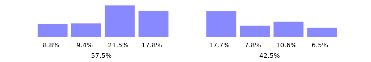
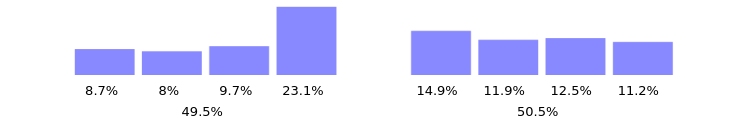
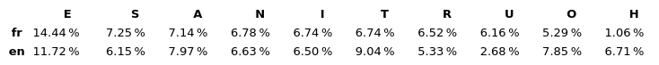

+++
layout = "slides"
+++

name: inverse
layout: true
class: center, middle, inverse

---
template: inverse

# Ergo-L : une disposition de clavier ergonomique et moderne

---
layout: false

## Qui suis-je?

- Léo Cazenave (mon vrai nom)
- Nuclear Squid (mon pseudo un peu partout)
- étudiant en L2 maths/info à Grenoble
- code principalement en OCaml et en Rust
- considère que le bon nombre de claviers est "un de plus" et que la sourie c'est mal

---
## Problématiques

- Qwerty / Azerty sont pourris
- Beaucoup de layouts optimisés en Anglais, très peu en Français
- Bépo ne corrige pas les problèmes d'Azerty

---
## Objectif d’ErgoL

- un layout qui optimise les 3×10 touches pour :
	+ français
	+ anglais
	+ programation
- conserve les raccouris claviers usuels (`ctrl+[QASZXCV]`)
- permet une typographie nickel
- confort >> Vitesse

---
## Une disposition confortable

- certains enchaînements demandent plus d'efforts que d'autre
- limiter le plus possible les enchaînements
- garder une charge des doigts / heatmap équilibrée

---
## L'héritage de Qwerty-Lafayette

- La touche morte
	+ permet d’écrire les accents et les ponctuations spéciales
- La couche `AltGr`
	+ pavé numérique sur la main droite
	+ regroupe tous les symboles de prog sur la main gauche
	+ optimisée pour les enchaînements courants :
		* `[0], [-1], (), !=, (''), >=, />`

---
## ErgoL

- similaire à Workman
- touche morte + `AltGr` du Qwerty-Lafayette
- tous les raccourcis clavier usuels conservés

---
## Variante compacte / évolutions possibles

- Ergo-L42 :
	+ Une seule touche morte
	+ Nouvelle couche AltGr (wip)
	+ (plus d'info sur ergol.org/42)
- serveur discord du projet : https://discord.gg/yDEWj6VtKn
- concocter un tester de layout adapté

---
template: inverse

# Ayé.

[https://ergol.org](ergol.org)
