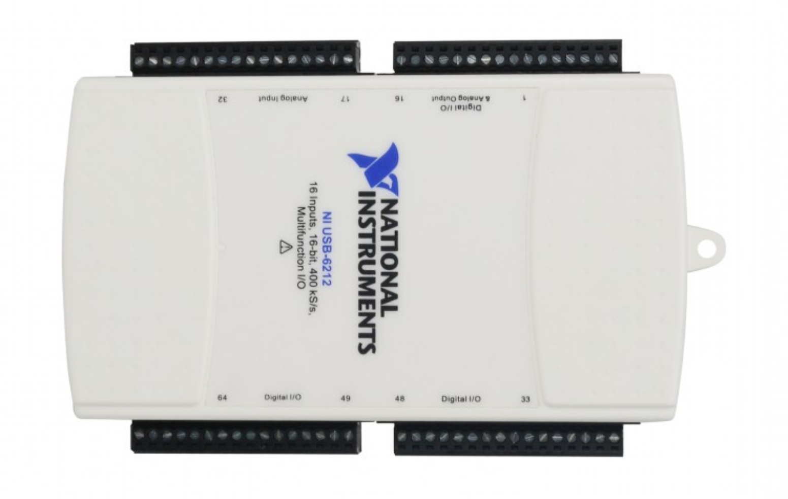
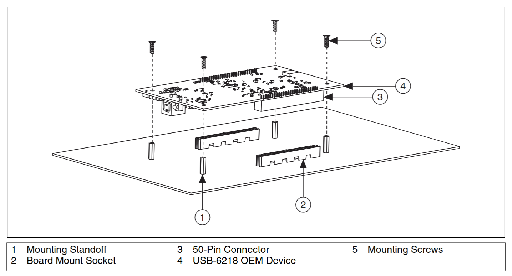
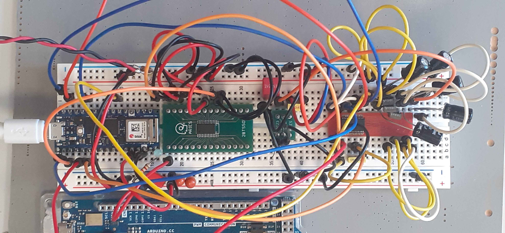

+++
layout = "slides"
+++

name: inverse
layout: true
class: center, middle, inverse

---
layout: false

# Sciduino, une alternative à LabVIEW et NI‑DAQ

- <small>[contexte](#2)</small>
- [Bornier vs Breadboard](#3)
- [Stack logicielle](#9)
- [Mise en œuvre](#13)
- <small>[conclusion](#16)</small>

.footnote[[Léo Cazenave](https://github.com/Nuclear-Squid) / RBI]

---
## Contexte

RBI développe des bancs de test depuis 1987

- soit entièrement électro-mécaniques
- soit pilotés par un PC :
  - NI-DAQ pour l’acquisition de données
  - LabVIEW pour le traitement (appli PC)

⇒ forte dépendance à National Instruments (NI) :
- pérennité incompatible avec les exigences aéro (30 ans)
- pas de solution à la fin de vie de la carte OEM (NI-6212)
- fermeture technologique
- coût

---
template: inverse

# Bornier vs Breadboard

---
## Bornier vs Breadboard

- NI-DAQ : approche « paillasse »
  - développement : on visse les signaux sur un boitier USB-DAQ
  - « industrialisation » : carte OEM enfichée sur un PCB maison
  - tout le code est exécuté sur le PC
- Breadboard : approche « proto »
  - développement : carte MCU et signaux sur une breadboard
  - industrialisation : carte MCU enfichée sur un PCB maison
  - le code critique tourne sur le MCU
  - l’interface utilisateur tourne sur le PC
  - liaison MCU/PC : USB + SCPI

⇒ objectif : mettre en place une stack orientée breadboard

---
## Prototypage NI-DAQ

Boitier USB multifonction
([NI-6212](https://www.ni.com/fr-fr/support/model.usb-6212.html)) et bornier à
vis :

---
## Intégration NI-DAQ

Carte [NI USB-6212 OEM](https://download.ni.com/support/manuals/372083c.pdf)
du banc BEP :

---
## Prototypage Nano/Nucleo32

Nano RP2040 + LTC1859 + Vref + MAX1300 :

---
## Intégration Nano/Nucleo32

L’empreinte Nano (footprint + pinout) est intéressante :

- supportée par Arduino et STM32  <small>(sauf placement du connecteur USB)</small>
- vaste choix de MCU  <small>(AVR, ARM, ESP32…)</small>
- pérenne (libre, déjà plus de 10 ans d’existence)
- moins répandue que Uno mais profite du format DIP :
  - plus adapté au breadboard
  - plus facile à intégrer à un PCB (= soudure THT)

RBI ne fait que des très petites séries et n’a pas intérêt à intégrer de MCU
directement sur ses PCB.

---
template: inverse

# Stack logicielle

---
## IDE micro-contrôleur

- **Arduino** : l’Espéranto de l’embarqué
  - **logiciel** : simple, libre, complet
  - **matériel** : excellente HAL, agnostique (AVR, ARM, ESP32…)
  - **pérennité** : empreinte Nano (~Nucleo32), gestion ARM Mbed
- **STM32** : la référence industrielle
  - **logiciel** : lourd, partiellement libre, restreint aux puces STM32
  - **matériel** : bonnes performances, mais ARM Cortex‑M seulement
  - **pérennité** : 10 ans sur les puces, pas de mention Mbed
- **RPi Pico** : l’alternative
  - **logiciel** : libre, ouvert, à utiliser avec un IDE généraliste
  - **matériel** : bonnes performances, PIO, Cortex‑M et RISC‑V
  - **pérennité** : 20 ans sur les puces, empreinte Pico

⇒ Arduino Nano correspond aux besoins actuels de RBI 
<small>⇒ (RPi Pico pourrait être la solution pour après)</small>

---
## IHM : Python+QML

- Python est un choix évident :
  - langage éprouvé et très courant
  - bibliothèques performantes : NumPy, SciPy, Pandas…
- Qt est le standard de fait pour les apps industrielles :
  - beaucoup de composants très aboutis (graphiques notamment)
  - QML = approche déclarative de Qt (plus simple, sans couplage)
  - PySide = intégration officielle Qt/QML pour Python
- comparé à LabVIEW :
  - gestion plus fine de l’UI, mais moins immédiat pour prototyper
  - meilleure qualité logicielle : `diff`, LSP, linters, type checkers…
  - déploiement possible sur un SBC (par ex. RPi Zero)
  - indépendance stratégique

**Sciduino** = SciPy + PySide + Arduino

---
## IHM : Python+QML

---
## Sciduino

Objectif : faciliter le développement d’applications embarquées et l’intégration de nouvaux composants.

- Des abstractions / interfaces :
    - timers hardware (wrapper sur des libs existantes)
    - ADC (built-in, SPI, I2C…) + mise à l’échelle
    - stockage / traitement des données : `Waveform`
- Communication avec le PC :
    - communication série : `SerialUSB` (ARM) ou `Serial` (AVR)
    - protocole SCPI (intégration et débug via le moniteur série)
    - transfert en ASCII (simplicité) ou binaire (1MB/s)

<small>Difficulté : aucune interface commune parmis les libs de timers.</small>

<small>⇒ Sciduino est aujourd’hui une app et deviendra une lib plus tard.</small>

---
template: inverse

# Mise en œuvre

---
## Carte BEP : 8 voies, 16 bits, 1 kHz

- Objectif révisé : un PCB avec Arduino Nano
  - objectif initial trop trivial et peu susceptible d’être réutilisé
  - besoin d’évaluer la faisabilité pour un devis RBI en cours
- Design électronique (KiCad) :
  - numérique : protéger le MCU des parasites
  - analogique : protéger l’ADC des perturbations
  - level shifters pour la compatibilité AVR (5 V) et ARM (3.3 V)
- Développement logiciel : application directe de Sciduino
  - (+ gestion d’un GPIO 16 bits spécifique à BEP)

Difficulté : apprentissage KiCad + design + routage. 
<!-- <small>(Merci au mentorat + DRC + revues de design + cycles courts !)</small> -->

Carte fonctionnelle (AVR et ARM), testée jusqu’à 10 kHz.

---
## Montée en compétence : électronique

= 25 % du temps de stage + gros travail perso (pet project)

- Mentorat :
  - les questions, même stupides, sont bienvenues  (par ex. transistor bipolaire, plan de masse…)
  - les étapes imparfaites sont acceptées
- Développement en cycles courts :
  - les projets *open-hardware* fournissent des points de départ
  - en cas de difficulté, on scinde en tâches plus atomiques
  - le *design rule checker* (DRC) évite beaucoup d’erreurs
  - les revues de design permettent des améliorations incrémentales
  - dans le doute, on fait une simulation ou un prototype

⇒ Démarche proche des standards du logiciel libre 
<small>(mais avec une inversion des rôles par rapport à mes habitudes)</small>

---
## Carte Dionysos : 2 voies, 8 bits, 1 MHz

- Objectif révisé : un proto pour une appication de TNS
  - l’USB hi-speed des MCU ne passe que 1 MB/s
  - traitement numérique sur le MCU + envoi de données discrétisées
- Utilisation du RP2040 :
  - les PIO offrent un moyen inédit de numériser le signal
  - performances élevées (2× 125 MHz, overclockable)
  - pérennité (20 ans)
- Rust embarqué
  - performances équivalentes à l’API C de Raspberry
  - abstraction matérielle (HAL) via des *traits* standardisés
  - gestion saine de la mémoire

Proto fonctionnel, décision à prendre côté RBI. 
L’application PC serait *grandement* simplifiée.

---
template: inverse

# Conclusion

---
## Résilience

- **QML** ⇄ GTK ou HTML+JS
  - ⇒ refaire les bindings Python
- **Python** ⇄ C++ ou Rust
  - ⇒ refaire les bindings QML
- **Arduino** ⇄ Rust ou MicroPython
  - ⇒ réimplémenter l’interface SCPI et le type `Waveform`
- **footprint Nano** ⇄ RPi Pico <small>(ou MKR, Feather, XIAO…)</small>
  - ⇒ adapter le footprint sur le PCB
- **RP2040** ⇄ n’importe quel MCU au format Nano
  - ⇒ changer de HAL en Rust, pratiquement rien en Arduino

<small>On troque un peu de facilité contre beaucoup de résilience.</small>

---
## Alternative ≠ Remplacement

- Sciduino ne *remplace* pas LabVIEW + NI‑DAQ
  - performances équivalentes à la NI-6212 (16 bits, 400 kS/s)
  - mais développement IHM très différent de LabVIEW
- Sciduino propose une *alternative* :
  - on utilise les compétences de RBI pour le design électronique
  - le code critique est exécuté directement sur le MCU
  - l’IHM peut être déployée indifféremment sur PC ou SBC
- Sciduino permet de viser une meilleure qualité :
  - outils de qualité logicielle (linters, diff…)
  - intégration plus « pro » au PCB
  - découplage application / IHM

Analogie : Sciduino est à LabVIEW+NI‑DAQ ce que Pandoc Markdown est à MS Office.

.footnote[[Léo Cazenave](https://github.com/Nuclear-Squid) / RBI]
