+++
layout = "slides"
+++

name: inverse
layout: true
class: center, middle, inverse

---
layout: false
class: middle, inverse

# Ergonomie des dispositions de claviers : l’ère post-Dvorak

---
## Qui suis-je?

- pseudo courant : Nuclear-Squid
- vrai nom : Léo Cazenave
- étudiant en informatique et électronique à Grenoble
- je traîne sur r/keyboard_layouts comme d’autres traînent sur pornhub
- dirige le projet Ergo-L

---
class: middle, inverse

# L’ère de Dvorak

---
## Qwerty (1878)

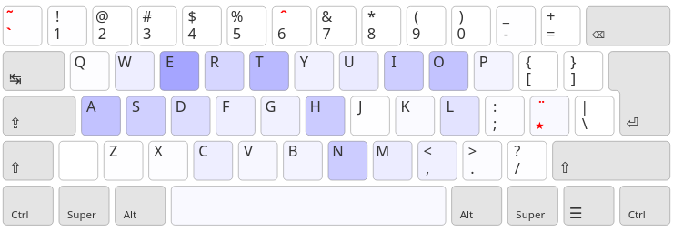

- touches fréquentes éloignées
- charge des doigts très déséquilibrée
- trop d’enchaînements rédhibitoires (SFU ~= 5.75%)

---
## Dvorak (1936)

- premier essai d’optimisation du clavier
- beaucoup plus efficace (SFU ~= 2.62%)
- perte des raccourcis claviers usuels

---
## Qwerty vs Dvorak <small>(pour la plupart des gens)</small>

- confort de saisie :
    + Qwerty : pas ouf
    + Dvorak : optimisé
- bureautique :
    + Qwerty : optimisé
    + Dvorak : pas ouf

---
## Bépo ! (2010)

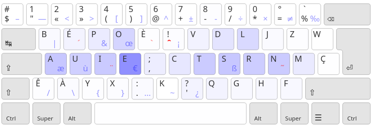

- SFU de 2.55%
- Dvorak pour le Français
- (*avec des changements débatables)

---
## Les contraintes des machines à écrire

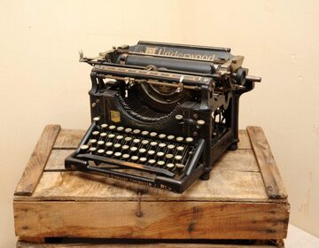

- Les roulements sont à éviter
- Les raccourcis n’existaient pas encore

=> Dvorak repose sur des principes dépassés

---
template: inverse

# L’avènement de  Colemak et du Planck

---
## Planck (2015)

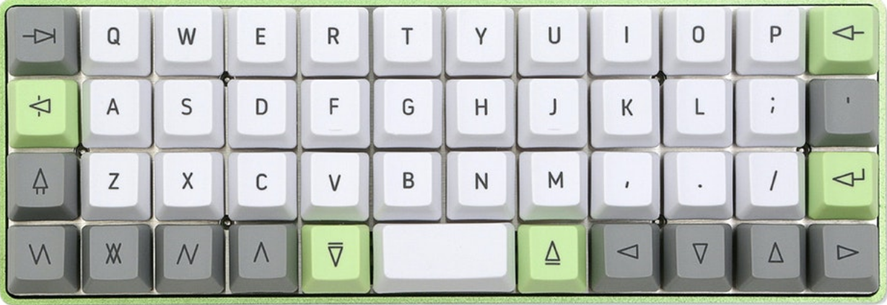

On déplace les touches sous les doigts, au lieu des doigts sur les touches

Pour comprendre l’intérêt, venez voir notre stand

---

    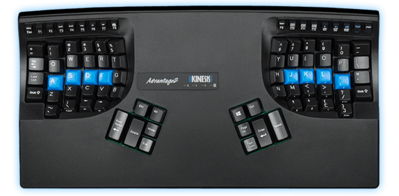 </img>
    
avant / après

    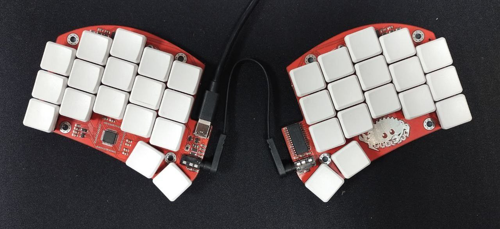 </img>

---
## Colemak (2006)

- raccourcis usuels conservés (sauf `ctrl+S`)
- favorise les alternances de mains *et* les roulements

=> meilleur que Dvorak **avec** les raccourcis de Qwerty

---
## Workman (2010)

- \+ *excellente* charge des doigts / heatmap
- \- SFU moins bon que Colemak (~2.55%)

---
template: inverse

# Développons une dispo     francophone moderne

---
## La stats à optimiser en priorité

les stats qu’on peut étudier :

- heatmap / charge des doigts
- taux de SFU / SKU
- proportion de roulements / changements de mains

Vous pensez quoi ?

---
## La stats à optimiser en priorité

les stats qu’on peut étudier :

- heatmap / charge des doigts
- taux de **SFU** / SKU
- proportion de roulements / changements de mains

=> aucune, on cherche à avoir ni la meilleure moyenne, ni le meilleur score possible sur une seule stat, mais limiter les points d’accroche.

---
## Objectifs d’Ergo-L

- un layout qui optimise les 3×10 touches pour :
    + français
    + anglais
    + programmation
<!-- - une ergonomie façon Colemak / Workman -->
- une ergonomie façon Colemak   <small>les raccouris claviers usuels (`ctrl+[QASZXCV]`)</small>
- une heatmap façon Workman
- permet une typographie nickel
- les chiffres en direct !!!
- compatible claviers compacts

---
## Français **et** anglais ??

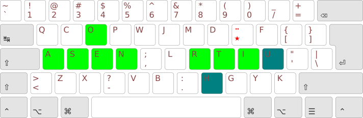

Donc oui, c’est carrément possible.

---
## Pourquoi pas le E sur l’index ?

- le `E` est de très loin la lettre la plus fréquente en français et anglais
- Bépo l’a fait
- aucun autre layout optimisé ne l’a fait

=> charge des doigts très déséquilibrée et enchaînements pourris

---
## Comment on gère les accents ?

On les donne en accés direct :
- en extension, comme Azerty
- dans les 3×10 touches, comme Bépo

=> pas compatible claviers compacts

 

On les met en AltGr :

=> source d’erreur à haute vitesse

(voir les travaux de Ben Vallack)

---
## Touche morte !

La touche morte permet de faire les accents, diacritiques et ponctuations spéciales

- \+ compacte
- \+ inratable
- \- ajoute ~4% de touches (dont 3% pour `é` et `’`)
- \- cause quelques SFB supplémentaires

=> Démo !

utilisée depuis 15 ans en Qwerty Lafayette

---
## AltGr

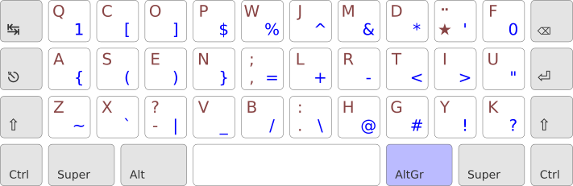

on peut avoir un AltGr dédié aux symboles de prog

enchaînements courants optimisés : `+=`, `=>`, `!=`, `$@`…

=> Re Démo !

---
## Petit jeu

---
## Petit jeu

---
## Attention aux stats

<small> charge des doigts d’Ergo-L en français : </small>

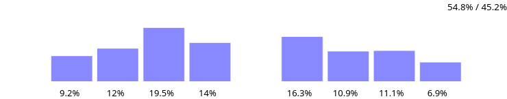

Ces stats permettent d’avoir une super vue d’ensemble, mais il faut savoir les interpréter

=> Toujours essayer la dispo avant de prendre une décision

---
## Attention aux stats

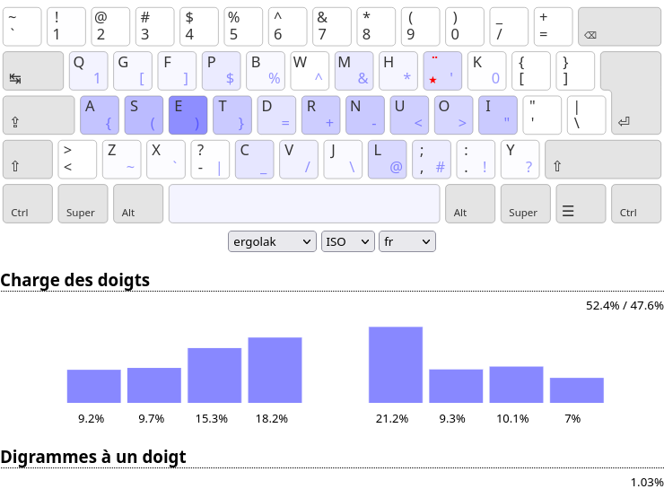

---
## Vers l’infini et au-delà !

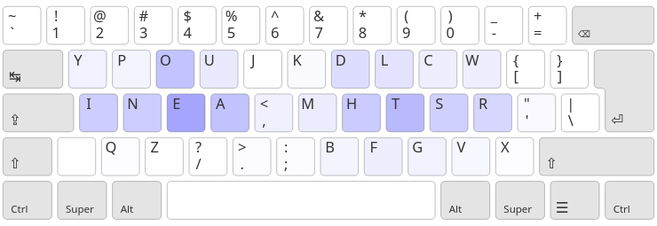

En renonçant à certains critères de confort*, on peut atteindre un taux SFU extrèmement bas : SFU=1.02% !

*(raccourcis usuels, charge des doigts…)

---
template: inverse

## Ergo-L est meilleur que Dvorak en anglais   et que Bépo en français

<small>(et que Qwerty en programmation)</small>

- Dvorak était pertinent sur des machines à écrire
- Colemak est bien meilleur sur les claviers modernes
- (et les claviers compacts, ça claque)
- <small>(et les chiffres en indirect, c’est infect…)</small>

[https://ergol.org](ergol.org)
