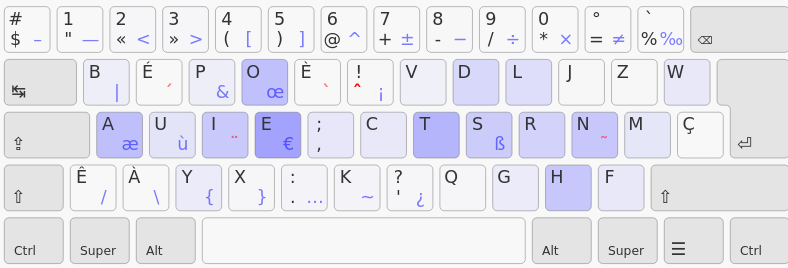

+++
layout = "slides"
+++

name: inverse
layout: true
class: center, middle, inverse

---
layout: false
class: middle, inverse

# Ergo‑L : le reboot de Bépo.

---
## Azerty

- touches fréquentes éloignées
- les accents sur la rangée des chiffres
- charge des doigts très déséquilibré
- le `A` ? le point en `shift`-`;` ?!?!

---
## Bépo ! (2010)

- les lettres fréquentes sont sur la « home-row »
- éviter la rangée des chiffres
- équilibrer le travail des mains
- favoriser les alternances

---
## Bépo ?

- rédhibitoire en anglais
- perte des raccourcis claviers usuels

---
## Azerty ou Bépo ?

- confort de saisie (fr / en) :
    + Azerty : pas ouf / pas ouf
    + Bépo : optimisé / affreux
- bureautique :
    + Azerty : optimisé
    + Bépo : pas ouf

---
## Pyramide de Maslow des claviers

- alternances
- lettres lettres sur la home row
- raccourcis claviers
- rangée des chiffres

=&gt Objectif : Faire une variante de Bépo qui marche en anglais et garde les
raccourcis usuels

---
template: inverse

# Un tour d’horizon des dispos anglaises

---
## Colemak

---
## Piramide (après Colemak)

---
## Workman

---
## Piramide (après Workman)

---
## La fusée de Maslow
