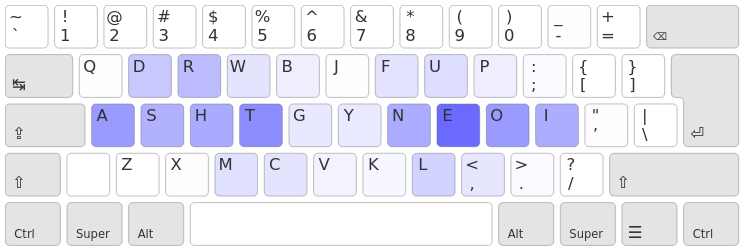

+++
layout = "slides"
+++

name: inverse
layout: true
class: center, middle, inverse

---
layout: false
class: middle, inverse

# Ergo‑L : le reboot de Bépo.

---
## Expérience personelle

- 15 ans de touch-typing
- a un problème avec les claviers mécaniques
- vimiste de longue date
- concepteur principal d’Ergo‑L :
    - 4 ans de développement
    - 9 changements de disposition à temps plein
    - plusieurs centaines de prototypes testés

(mon pseudo : Nuclear Squid)

---
## Azerty

- touches fréquentes loins des positions de repos
- les accents sur la rangée des chiffres
- très mal équilibré
- le `A` ? le point en `shift`-`;` ?!?!

---
## Bépo ! (2008)

- les lettres fréquentes sont sur la « home-row »
- aucune lettre sur la rangée des chiffres
- travail des mains équilibré
- alternances des mains

---
## Pyramide de Maslow des claviers

    

---
## Bépo ?

- rédhibitoire en anglais (`WH` ?!?!)
- perte des raccourcis claviers usuels   <small>(Ctrl + {`q`, `a`, `s`, `z`, `x`, `c`, `v`})</small>

---
continued: true

=> Bépo optimise la saisie de texte en français, mais est moins polyvalent qu’Azerty

---
## Pyramide de Maslow des claviers (v2)

    

---
continued: true

=> Objectif : faire une variante de Bépo qui marche en anglais et conserve les
raccourcis usuels

---
template: inverse

# Un tour d’horizon des dispos anglophones

---
## Dvorak (1936)

- la dispo qui a servi de base pour Bépo
- <small>(voir "[Ergonomie des dispositions de claviers : l’ère post-Dvorak](https://www.youtube.com/watch?v=96RikfmBY-U)")</small>

---
## Colemak (2006)

- raccourcis usuels conservés (sauf `ctrl+S`)
- index chargés, auriculaires allégés
- favorise les alternances de mains *et* les roulements   <small> (roulement = enchaînement de même main confortable)</small>
- ~1.6% de SFU

---
## Bigramme de même doigt

Roulement (ex : `OU`) ou Alternance (ex : `EU`) :

- on **peut** actionner une touche avant d’avoir relâché la première 
- la frappe est fluide

---
## Bigramme de même doigt

Bigramme de même doigt (ex : `DE`) :

- on **doit** relâcher la première touche avant d’actionner la seconde
- la frappe est très lente et inconfortable

<small>(SFU : Same Finger Usage, taux de bigrammes de même doigt)</small>

---
## Roulements vs Alternances

Hypothèse : les alternances parallélisent la frappe et permettent d’aller plus
vite et plus confortablement.

Expérience : 5 minutes pour faire le meilleur temps possible sur :

- Alternance parfaite (`a;sldkfj` × 4)
- Roulements parfaits (`asdf;lkj` × 4)

<small>(typing test effectué sur monkeytype.com)</small>

---
## Roulements vs Alternances

- Alternances : ~130 mots par minutes

- Roulements : ~195 mots par minutes

---
continued: true

=> Les roulements sont beaucoup plus confortables et efficaces que les alternances

---
## Colemak ?

L’extension latérale sur `HE` (le deuxième bigramme le plus fréquent en
anglais) peut être douloureuse.

---
## Workman (2010)

- *excellente* heatmap
- évite les extensions latérales
- ~2.7% de SFU (pas ouf)

---
continued: true

=> L’optimisation ne sert à rien tant qu’il reste des problèmes d’ergonomie.

---
## Une bonne heatmap

 

    

Workman suit la philoposhie 1DFH  
(1u displacement from home)

<small>(voir la [conférence sur Arsenik](https://fabi1cazenave.github.io/slides/2024-cdl))</small>

---
### Les mauvais roulements

- LSB (extensions latérales) : `ET` (Qwerty) / `HE` (Colemak)
    - Roulement où une des touches est sur la colonne centrale
- Ciseaux : `CR` (Qwerty)
    - Roulement avec un changement inconfortable de rangée
- Mauvaises redirections : `EAS` (Qwerty) / `YOU` (Colemak)
    - Composition de deux roulements de sens opposés sans aucune touche sur un index

---
## La pyramide de Maslow

    

---
## La fusée de Maslow

    
    

---
template: inverse

# Bépo vs the World !!

(comparaisons de dispos)

---
## Les dispos anglophones

    

---
## Les dispos anglophones

    
    

---
## Les dispos anglophones

    
    

---
## Les dispos francophones

    

---
## Les dispos francophones

    
    

---
## Les dispos francophones

    
    

---
## Les dispos francophones

    
    

---
## « L’ergonomie holistique des claviers »

 

- raccourcis claviers => usage clavier + souris
- claviers compacts => éliminer les extensions
- la dispo n’est qu’*une* partie du problème : on compose différents systèmes
  entre eux

=> voir la conférence sur Arsenik

---
## Bépo : la singularité de l’ergo clavier

 

- perte des raccourcis usuels => pas adapté pour un usage clavier + souris
- les 4 cavaliers de l’auriculaire => un gros clavier (souvent cher)
- chiffres en shift => un pavé numérique

De plus, le pavé numérique décale la souris, et donc demande beaucoup plus
d’effort que la rangée des chiffres.

---
## L’impasse

Beaucoup de progrès par rapport à Qwerty / Azerty, **mais** :

- l’auriculaire droit cause des douleurs chez beaucoup de gens
- beaucoup de variantes (Béopy, Bépo-intl…) optimisent encore plus la dispo mais ne
  résolvent pas les problèmes d’ergonomie
- gros biais de sélection : les Bépoètes se sont accommodés des défauts de la dispo

---
continued: true

=> Bépo est optimisé mais anti-ergonomique.

---
class: middle, inverse

    

---
## Objectifs d’Ergo‑L

- une dispo 1DFH optimisée pour 
    + français
    + anglais
    + programmation
- conserver les raccourcis claviers usuels
- ergonomique avant tout

---
continued: true

 

Objectifs supplémentaires :

- permet une typographie nickel
- chiffres en direct !!!!

---
## « Soyez pas con, ayez des stats » – moi

un évaluateur : la page de stats d’Ergo‑L

une méthode :

1. on repère les pires achoppements d’une dispo
2. on met à jour l’analyseur (si besoin)
3. on cherche à corriger les défauts
4. si on y arrive on teste la dispo en vrai
5. `goto 1`

---
## Comment on gère les accents ?

On les donne en accès direct :
- en extension, comme Azerty
- dans les 3×10 touches, comme Bépo

=> pas 1DFH

---
continued: true

 

On les met en AltGr (comme Bépo, aussi) :

=> source d’erreur à haute vitesse (erreurs de timing)

(voir les travaux de Ben Vallack)

---
## Touche morte !

<small>(idée honteusement volée à Qwerty‑Lafayette)</small>

La touche morte permet de faire les accents, diacritiques et ponctuations spéciales

- \+ compacte
- \+ inratable

=&gt; Démo !

---
## Touche morte !

<small>(idée honteusement volée à Qwerty‑Lafayette)</small>

La touche morte permet de faire les accents, diacritiques et ponctuations spéciales

- \+ compacte
- \+ inratable
- \- ajoute ~4% de touches (dont 3% pour `é` et `’`)
- \- rajoute un peu de SFU

---
## Le `É` en deux touches, ça pique non ?

« Je continue mon entrainement dans ergo-l et je dois dire que Merde! Finalement la touche morte est pas si effrayant que ça. » – @timeprince

« La touche morte je l’adore, parce que ça veut dire qu’il y a deux fois plus de caractères en home row, et ça c’est trop bien. » – @galipeth

« La touche morte, que j’appréhendais un peu au début, s’avère très naturelle à l’utilisation. Je ressens parfois la légère pénalité en termes de frappes sur les mots avec plusieurs accents, mais je trouve le compromis (1DFH) plus que satisfaisant pour mon cas. » – @fnuttens

---
## Henri Lœvenbruck <3 <3 <3

« Faut dire que j’avais un clavier un peu spécial, lui aussi, qui en faisait du
bruit. D’abord, il avait une disposition originale, qui s’appelait Ergo‑L, avec
un arrangement des lettres qui permettait d’écrire plus vite et sans se faire
mal. Ensuite, mon clavier, […] il avait des touches mécaniques qui avaient une
belle résistance sous les doigts et qui faisaient ce délicieux tintamarre. »

---
## Des compromis entre français et anglais

- `H` est fréquent en anglais, pas en français
- `★` et `U` sont fréquents en français, pas en anglais

Au final, relativement peu de compromis importants

---
## Le placement des voyelles

Les voyelles sont soit :

- empilées ensembles (comme `oe` ou `★i`)
- sur des auriculaires, pour mettre des lettres pas fréquentes autour (comme `a` et `u`)

<small>(et pas le `e` sur un index, ça cause trop de SFU)</small>

---
## Le placement des symboles de prog

- les symboles sont organisés par blocs (délimiteurs, arithétiques, ponctuation…) =&gt; simple à apprendre
- optimise les déplacements vim (`{}[]+-`)
- aucun enchaînement courant inconfortable !

---
template: inverse

# Ergo‑L : le reboot de Bépo.

---
## La fusée d’Ergo‑L

---
continued: true

 

- ~1.15% de SFU
- pas d’enchaînement courrant inconfortable
- français, anglais **et** prog en 1DFH

---
## Ergo‑L, une dispo composable

- compatible avec **tous** les claviers (≥ 33 touches)
- les raccourcis claviers usuels conservés (+ `Ctrl`-`O`)
- compatibles applis POSIX (`+-` en `AltGr` + `JK`)
- chiffres en direct !!! (pas de pavé num)

---
## Vous avez *déjà* Ergo‑L

Ergo‑L a été inclus dans XKB-config 2.42 et est disponible dans :

    <ul>
        <li> Arch (btw) / Manjar<strong>no</strong> </li>
        <li> Debian 13 "Trixie" </li>
        <li> Ubuntu LTS 24.04* </li>
        <li> NixOS 24.11 </li>
        <li> Fedora 41 </li>
        <li> Alpine Edge </li>
        <li> Gentoo </li>
    </ul>

---
continued: true

 

et si votre distro l’a pas, c’est simple à installer, les instructions sont
disponibles sur notre [site web](https://ergol.org/installation/)

---
## Ergodis

Ergodis c’est l’asso qui a conçu Bépo.

Aujourd’hui, Ergodis fait la pub d’Ergo‑L et Kalamine au même titre que Bépo.

---
continued: true

« C’est vraiment dans la continuation de ce qu’on a voulu faire avec Bépo »

---
continued: true

Plusieurs membres du bureau tapent en Ergo‑L

---
## La famille Lafayette

Deux points communs :

1. le concept de touche morte à tout faire
2. la *même* couche prog

    
    
    

---
## Merci aux Ergonautes <3 <3 <3

    <ul>
        <li> <a href="https://github.com/fabi1cazenave"> Kazé </a> </li>
        <li> <a href="https://github.com/lobre"> Lobre </a> </li>
        <li> <a href="https://github.com/Geobert"> Geob-o-matic </a> </li>
        <li> <a href="https://github.com/nivopol"> Nivopol </a> </li>
        <li> <a href="https://github.com/Lysquid"> Lysquid </a> </li>
        <li> <a href="https://github.com/Ced-C"> Cèd’C </a> </li>
        <li> <a href="https://github.com/etienne-monier"> Étienne Monier </a> </li>
        <li> <a href=""> Fougasse </a>  </li>
        <li> <a href="https://github.com/trilowy"> Trilowy </a> </li>
    </ul>
    <ul>
        <li> <a href="https://github.com/gagbo"> Moussx </a> </li>
        <li> <a href="https://github.com/PatrickMassot"> Patrick Massot </a> </li>
        <li> <a href="https://github.com/Chouhartem"> Chouhartem </a> </li>
        <li> <a href="https://codeberg.org/cedricr"> Cedricr </a> </li>
        <li> <a href="https://github.com/wismill"> Wismill </a> </li>
        <li> <a href="https://h4.io/@helioselene"> Nuitjour </a> </li>
        <li> <a href="https://github.com/fnuttens"> fnuttens </a> </li>
        <li> <a href="https://github.com/TeXitoi"> TeXitoi </a> </li>
        <li> <a href="https://piaille.fr/@loevenbruck@toot.portes-imaginaire.org"> Henri Lœvenbruck </a> </li>
    </ul>
    <ul>
        <li> <a href="https://github.com/ClemABT"> ClemABT </a> </li>
        <li> <a href="https://github.com/robinmoussu"> Aeshar </a> </li>
        <li> <a href="https://github.com/c4software"> Valentin B </a> </li>
        <li> <a href="https://github.com/PetitWombat"> Ju__ </a> </li>
        <li> <a href="https://github.com/Maiann88"> Meriem </a> </li>
        <li> <a href="https://github.com/aurelberra"> Aurelberra </a> </li>
        <li> <a href="https://github.com/cypriani"> Xiloynaha </a> </li>
        
 <small> …et d’autres </small> 

        
 Merci à vous ! 

    </ul>

