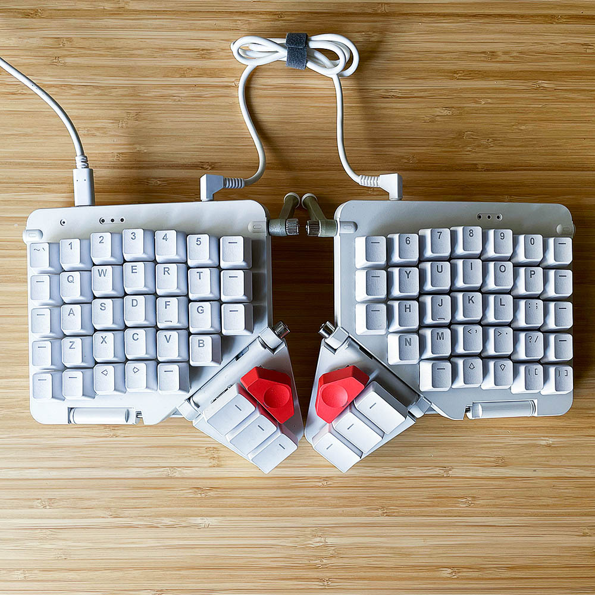
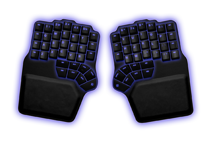
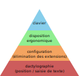
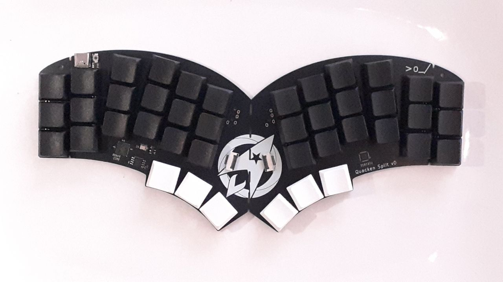

+++
layout = "slides"
+++

name: inverse
layout: true
class: center, middle, inverse

---
layout: false
class: middle, inverse

# Quacken: un clavier ergonomique, libre et polymorphe.

---
## Expérience personelle

- 15 ans de touch-typing
- a un problème avec les claviers mécaniques
- vimiste de longue date
- concepteur principal d’Ergo‑L et du Quacken

(mon pseudo : Nuclear Squid)

---
## « Je voudrais bien un clavier ergonique »

Pleins de raisons possible :

- ça prévient les TMS
- c’est confortable
- le nerd factor
- etc

Il y a juste un soucis…

---
## « Ah… »

    

        
        
 ZSA Moonlander ~300 € 

    

    

        
        
 Dygma Defy ~350 € 

    

<small>(sans les frais de douane)</small>

---
## Constat

Les claviers ergonomiques courrants sont :

- beaucoup trop cher
- avant tout des claviers « prémiums »

---
continued: true

Pourquoi pas faire notre propre clavier ergo, libre et économique ?

<small> #WhatCouldPossiblyGoWrong </small>

<!-- --- -->
<!-- ## Préambule -->
<!---->
<!-- <!-- **Aucun clavier n’est ergonomique sans méthode dactylo** --> -->
<!--  -->

---
layout: false
class: middle, inverse

# Un marché de niche

---
## Microsoft, Logitech

- fabrication en grande série ⇒ pas cher (< 100 €)
- géométrie ANSI ou ISO : rien d’ergonomique (ou si peu)
- peuvent être utilisé sans méthode dactylo

---
## Kinesis, ZSA, Moergo

- fabrication en petite séries ⇒ cher (200–400 €)
- recherche d’un compromis entre efficacité et facilité

---
## Claviers libres

- modèles open-hardware, surtout conçus avec Ergogen et Pro Micro
- firmwares open-source : QMK, ZMK
- PCB disponible chez des revendeurs ou via JLCPCB
- prix correct : ~100 € en DIY, ~200 € chez des revendeurs
- l’ergonomie peut être très poussée

---
## Objectifs du Quacken

- géométrie vraiment ergonomique
- aussi libre que possible
- le moins cher possible (< 100 €)
- facile à fabriquer

---
layout: false
class: middle, inverse

# Une ergonomie qui évolue

---
## (1990–2000) Kinesis, Typematrix, Ergodox

- géométrie en colonnes ⇒ favorise la dactylographie
- mouvements plus naturel ⇒ moins de fau de frappe

---
## (2015) **1DFH :** Planck, Corne, Atreus

- réduction drastique du mouvement des doigts en 3×6
- le confort est encore plus en 3×6
- les *layers* permettent de supprimer les extensions
    - <small> ⇒ on fait venir les touches sous les doigts au lieu de déplacer les doigts vers les touches </small>
- /!\ trois touches par pouces, sinon HRM

---
## Stagger + Choc : Ferris

- réduction sensible du mouvement vertical des doigts
- on peut taper avec les mains plus à plat
- déroutant mais efficace

---
## Splay : Totem, Dasbob

- gain en confort, on peut taper encore plus à plat

---
## Ultra-compact : Hummingbird

- clavier monobloc 28 touches
- conçu initialement autours des contraintes du XIAO
- intérêt ergonomique évident, mais très niche

---
# Le Quacken

---
## Géométrie radiale

- stagger + splay + touches de pouce en arc de cercle
- convertible monobloc / split

---
## Polymorphie : touche médianes

- 3 des 6 colonness du Quacken sont utilisable avec 2 touches au lieu de 3
- objectif : pouvoir tester le Hummingbird sans racheter un clavier

---
## 42 touches seulement ?

- un 4×6 a peu d’intérêt :
    - il faut quand même un layer pour les quelques touches manquantes
    - il en faut *en plus* symétriser les touches de pouces
    - il ne permet pas de taper aussi à plat qu’un 3×6
- un 3×6 ne pose aucun soucis si on sait taper en dactylo (touch-typing)
- beaucoup d’ergonautes ont débuté directement sur un 3×6, voire 3×5

---
layout: false
class: middle, inverse

# Configuration

---
## Arsenik

- 42 touches sans touches dual
- 34 touches avec HRM
- approche progressive : d’abord les layers-taps, puis les HRM
- utilisable sur PC via Kanata

---
## Sane defaults

- configuration validée auprès d’un public large (néophytes et expert·e·s)
- couche de symbole issue d’Ergol et Lafayette
- soin particulier au *timings*, grâce à ZMK

---
## Dispositions francophones

- aucune adaptations pour Ergo‑L, Lafayette, Bépolar…
- adaptation d’Azerty via une touche morte

Le Quacken apporte l’essentiel des gains d’Ergo‑L aux dispositions classiques (Azerty, Qwerty, Bépo)

---
layout: false
class: middle, inverse

# Conception

---
## Ergogen 

- on est parti de géométries qu’on aimait bien : Ferris, Totem
- conception « monobloc first », inspiré par l’Atreus
- touches de pouce plus sortis que sur le Corne

---
## KiCad

- outil de conception électronique
- plans disponible sur GitHub
- limite : les plans sont en ligne que quand le batch est payé

---
## FreeCad

- conception des boitiers (optionnels)
- intégration de futurs dispositifs de pointage

---
layout: false
class: middle, inverse

# Les Ergonautes

---
## Zéro et Flex

Une géométrie (Quacken 1.0), deux modèles (Zéro et Flex)

|                                  | Flex | Zéro |
|----------------------------------|:----:|:----:|
| Splittable                       | V    | X    |
| Colonnes extérieures splittables | V    | V    |
| Positions médianes               | V    | V    |
| Rotary Encoders                  | V    | V    |
| Dispositifs de pointage*         | V    | V    |
| Bluetooth                        | X    | V    |

<small> Dispositifs de pointage prévu pour plus tard </small>

---
## Batch proto du Zéro

- conception Pro Micro (= top pour le BLE, correct pour le filaire)
- validation de la géométrie en monobloc 42 touches
- batterie 110mAh ⇒ 2 à 3 mois d’autonomie escomptée
- batch de 20 unités (R&D + early adopters)
- firmwares ZMK et Keyberon

---
## Batch proto du Flex

- MCU intégré (RP2040) pour limiter les coûts et faciliter la fabrication
- peaufinage de la géométrie
- aucun composant sous le PCB ⇒ facile à souder et transporter
- convertible : MCU + IO expander + liaison PC
- batch de 5 unités (R&D uniquement)
- firmware ZMK fait, Keyberon à venir

---
layout: false
class: middle, inverse

# Fabrication

---
## X-mas batch

- version finalisée du Flex
- on prend les commandes dès maintenant
- le nombre permet de tirer les prix vers le bas
- les options de boitiers arriveront plus tard

---
## Rolling releases

- chaque batch est l’occasion de tester *une* nouveauté (baby steps)
- la géométrie ne bouge plus (Quacken 1.0)… ou marginalement

---
## Prix libre

- objectif : un clavier quali pour moins de 100 €
- les sous font tourner l’asso (serveur web, batchs R&D)
- nos compte sont publics
- on accepte les dons

---
layout: false
class: middle, inverse

# Roadmap

---
## Construction « Bling »

- sockets hotswap + RGB underglow
- un boitier sera recommandé
- la construction actuelle reste disponible (« Éco »)

---
## Boitiers

- plaque de renfort entre le PCB et les keycaps
- film silicone (Éco) ou plaque acrylique (Bling) sous le clavier
- intégration de dispositifs de pointage (trackpoints / touchpad)

---
## Bluetooth

- Zéro révisé avec le contrôleur intégré (objectif JdLL 2026 ?)
- Marie-Quackenette = split, double contrôleur, double batterie (objectif = ???)

---
## Contribuer

- venir tester le Quacken sur le stand
    - feedback apprécié (néophytes et expert·e·s)
- contribuer à la conception
    - KiCad ? FreeCad
    - Web ? Graphisme ? (un logo pour le Quacken serait top !)

---
## Merci

    

        
 Marques recommandées 

        <ul>
            <li> KeyboardIO </li>
            <li> BastardKB </li>
        </ul>
        
 Marques déconseillées 

        <ul>
            <li> ZSA </li>
            <li> Dygma </li>
        </ul>
        
 Nous suivre 

        <ul>
            <li> Masto : #QuackenXMasBatch </li>
            <li> HelloAsso : Les ergonautes </li>
        </ul>
    

    

        
 Revendeurs recommandés 

        <ul>
            <li> SplitKB </li>
            <li> Keeb Supply </li>
        </ul>
        
 Claviers recommandés 

        <ul>
            <li> Corne </li>
            <li> Ferris </li>
            <li> Totem </li>
        </ul>
    

