+++
layout = "slides"
+++

layout: false
class: middle, inverse

# Quacken: un clavier ergonomique, libre et polymorphe.

---
## Expérience personelle

- 15 ans de touch-typing
- a un problème avec les claviers mécaniques
- vimiste de longue date
- concepteur principal d’Ergo‑L et du Quacken

(mon pseudo : Nuclear Squid)

---
## préambule

---
## « Je voudrais un clavier ergonomique »

Pleins de raisons possible :

- ça aide certains à apprendre la dactylographie
- ça prévient les TMS
- c’est confortable
- le nerd factor
- etc

Il y a juste un soucis…

---
layout: false
class: middle, inverse

# Un marché de niche

---
## Microsoft, Logitech

    

- fabrication en grande série ⇒ pas cher (< 100 €)
- géométrie ANSI ou ISO : rien d’ergonomique
- peuvent être utilisé sans méthode dactylo

---
## Kinesis, ZSA, Moergo…

    

- fabrication en petite séries ⇒ cher (200–400 €)
- recherche d’un compromis entre efficacité et facilité

---
## Claviers libres

    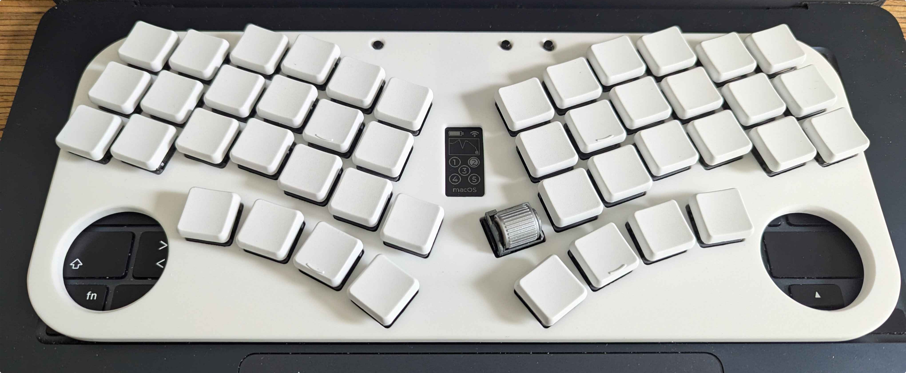

- modèles open-hardware, surtout conçus avec Ergogen et basé sur un Pro Micro
- firmwares open-source : QMK, ZMK
- PCB disponible chez des revendeurs ou via JLCPCB
- prix correct : ~100 € en DIY, ~200 € chez des revendeurs
- l’ergonomie peut être très poussée

---
## Objectifs du Quacken

    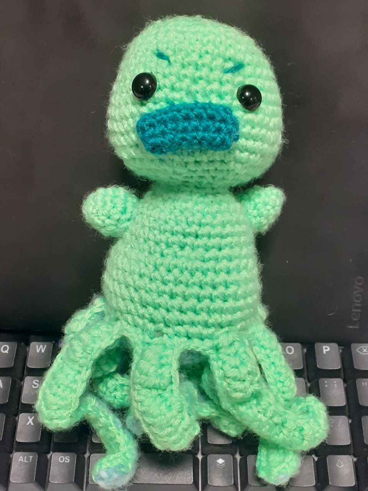
    

        <ul>
            <li> géométrie vraiment ergonomique </li>
            <li> aussi libre que possible </li>
            <li> le moins cher possible (< 100 €) </li>
            <li> facile à fabriquer </li>
        </ul>
    

---
layout: false
class: middle, inverse

# Une ergonomie qui évolue

---
## (1990–2010) Kinesis, Typematrix, Ergodox

    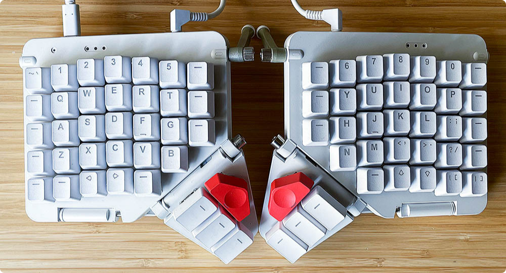

- géométrie en colonnes ⇒ favorise la dactylographie
- mouvements plus naturel ⇒ moins de fautes de frappe

---
## (2015) **1DFH :** Planck, Corne, Atreus

    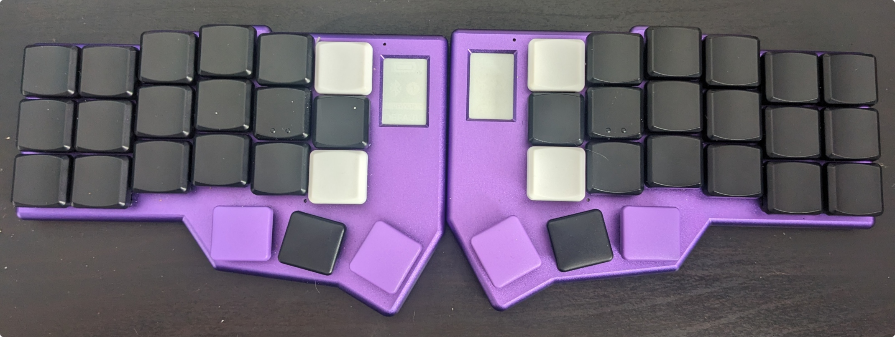

- réduction drastique du mouvement des doigts en 3×6
- encore plus de confort en 3×5
- les *layers* permettent de supprimer les extensions   <small style="font-size: 0.65em; margin-left: -1.5em"> ⇒ on fait venir les touches sous les doigts au lieu de déplacer les doigts vers les touches </small>
- /!\ trois touches par pouces, sinon HRM

---
## Stagger + Choc : Ferris

    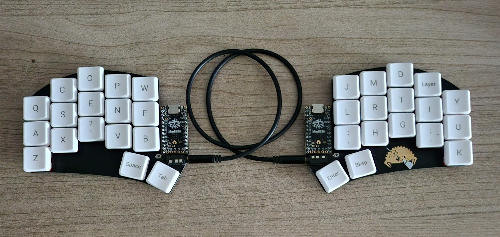

- réduction sensible du mouvement vertical des doigts
- on peut taper avec les mains plus à plat
- déroutant mais **très** efficace

---
## Splay : Totem, Dasbob

    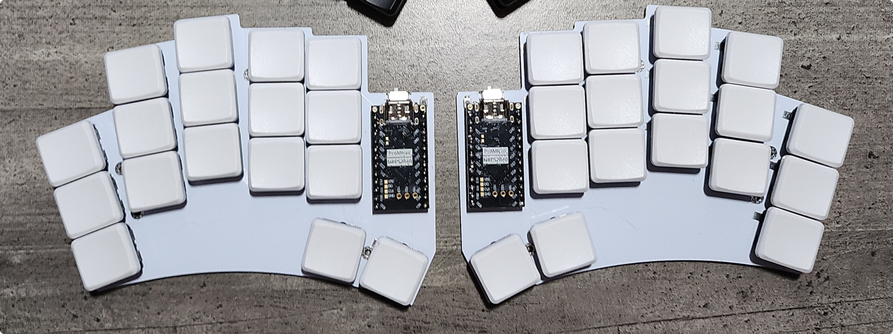

- gain en confort, on peut taper encore plus à plat
- on passe sur une géométrie « radiale »

---
layout: false
class: middle, inverse

# Le Quacken

---
## Ergogen : Géométrie radiale

    

- placement paramétrique des touches
- splay marqué sur l’annulaire et auriculaire
- touches de pouce en arc de cercle

« Radial, mais pas radical »

---
## KiCad : Électronique

    

- Micro-contrôleur (RP2040) intégré
- IO-expander pour la main droite
- Montage « diodeless »

---
## FreeCad : Mécanique

    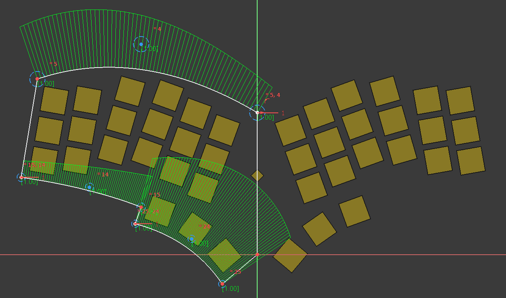

- Outline du PCB
- Design de plates / cases (à venir)
- Intégration de touchpad / trackpoints (à venir)

---

    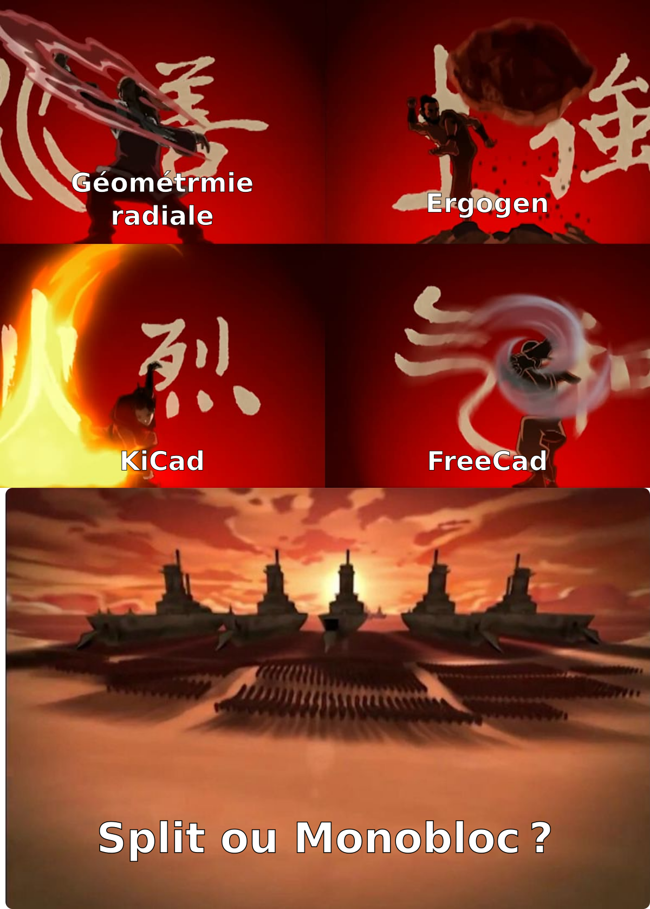

---
layout: false
class: middle, inverse

# Polymorphie

---
## Rotary encoders

    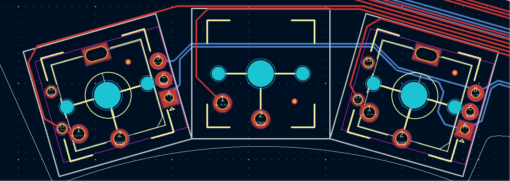

- problème : certaines personnes aiment pas les touches de pouces repliées ou étendues
- solution : on permet de remplacer des touches par des rotary encoders

---
## 6ième colonne sécable

    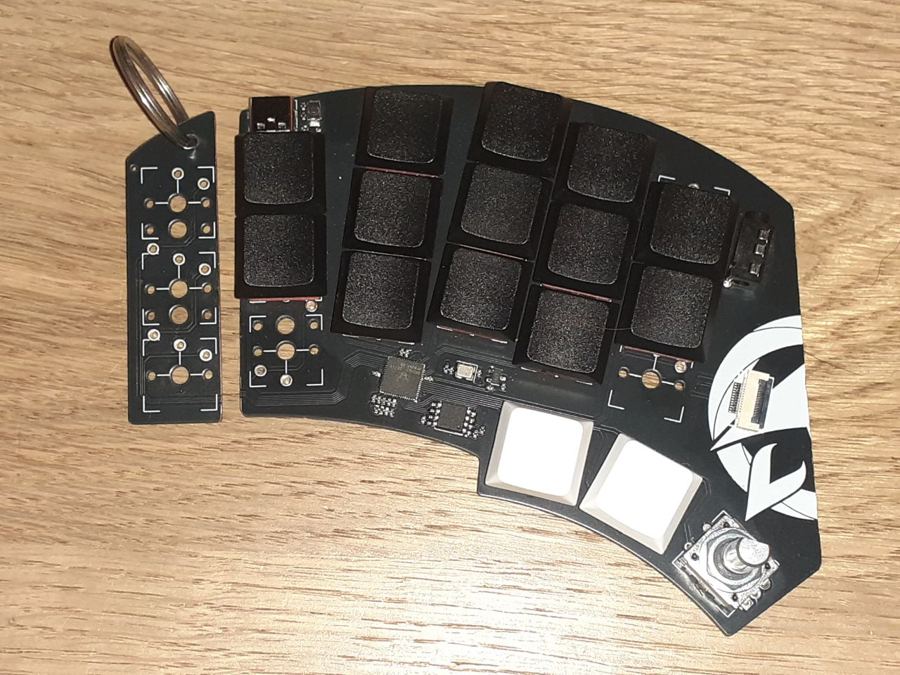

- problème : certains veulent 6 colonnes, d’autres 5
- solution : on transforme la 6ième colonne en porte-clés

---
## PCB splitable

    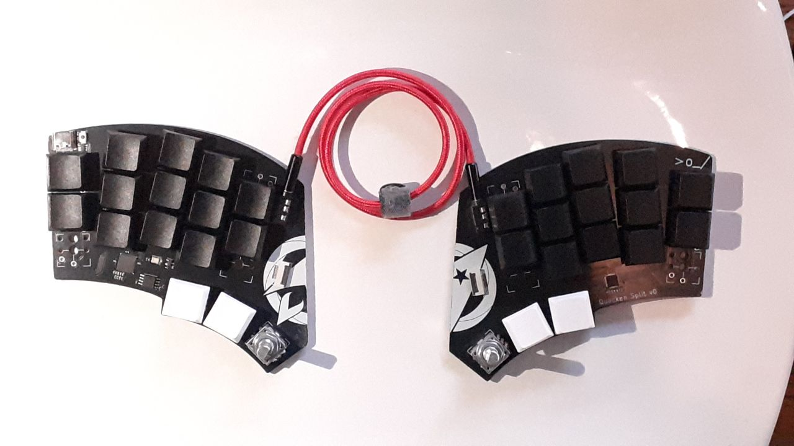

- main gauche = MCU, main droite = IO-expander I2C
- monobloc : bus I2C porté par des pistes
- split : bus I2C porté par un cable jack TRRS

---
## Ultra-compact : Hummingbird

    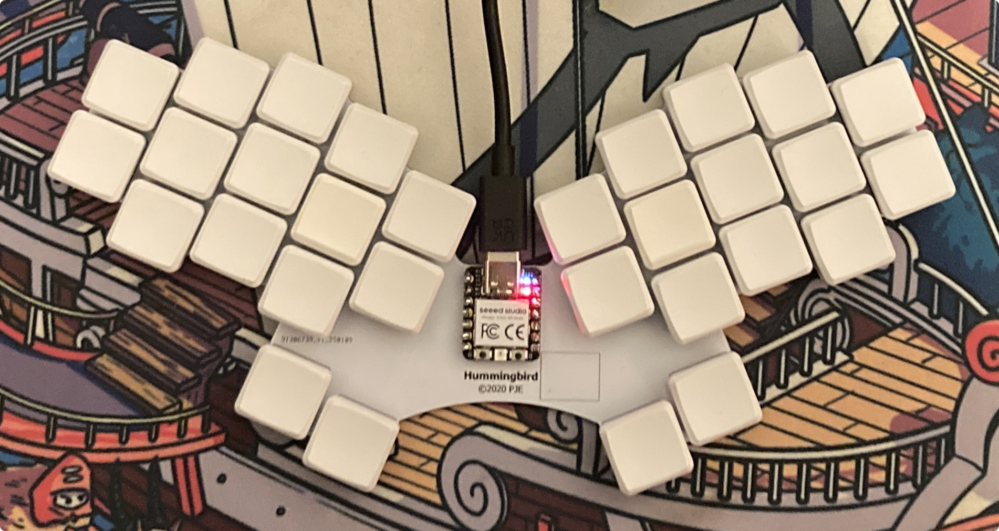

- 2 touches à mi-hauteur sur les colonnes n⁰1 et n⁰5
- conçu pour rentrer sur un XIAO (MCU très compact)
- prise en main difficile
- **gros** gain de confort

---
## Positions médianes

    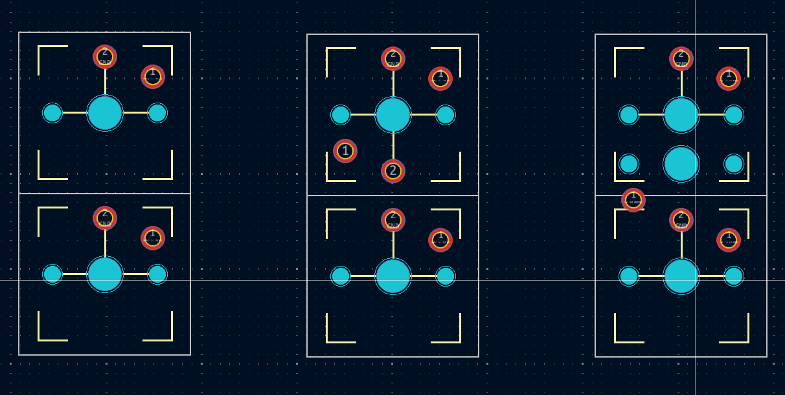

1. on duplique une touche
2. on la tourne de 180⁰
3. on la descend jusqu’a avoir une pin en commun avec la touche du dessous (reliée à GND)
4. paf, ça y fait du hummingbird

---
layout: false
class: middle, inverse

# Configuration

<!-- --- -->
<!-- ## **ZMK**rash-course -->
<!---->
<!-- ZMK peut définir des *layers* : -->
<!---->
<!-- - Le *layer* par défaut : -->
<!---->
<!-- 
 -->
<!--      -->
<!-- 
 -->
<!---->
<!-- - Mêmes touches dans le *layer* des nombres : -->
<!---->
<!-- 
 -->
<!--      -->
<!-- 
 -->
<!---->
<!-- ZMK peut aussi définir des *tap-holds* : -->
<!---->
<!-- - Si la touche est cliquée : `entrée` -->
<!-- - Si la touche est maintenue : `layer num` -->

---
## 42 touches seulement ?

    <!--  -->
    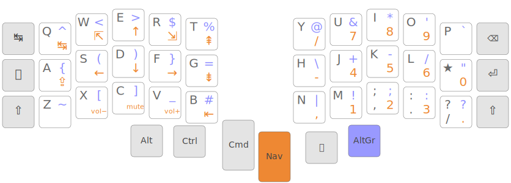

- un 4×6 a peu d’intérêt :
    - il faut quand même un layer pour la navigation
    - il en faut *en plus* symétriser les touches de pouces
    - ça ne permet pas de taper aussi à plat qu’un 3×6
<!-- - un 3×6 ne pose aucun soucis si on sait taper en dactylo (touch-typing) -->
- beaucoup d’Ergonautes ont débuté directement sur un 3×6, voire 3×5

---
## Le « syndrome Glove 40 »

    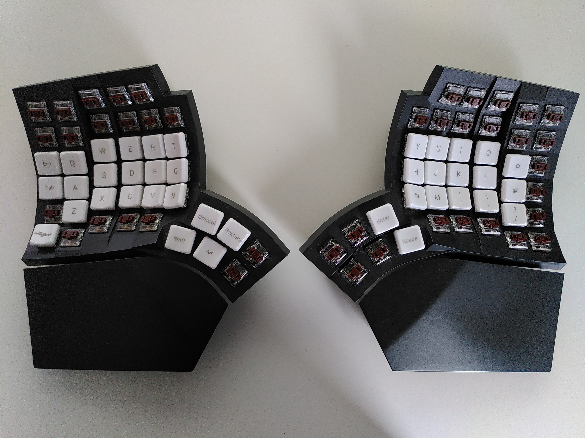

on utilise pas des layers parce qu’on manque de touches, on a des touches en trop parce qu’on utilise des layers

---
## Arsenik

    

- 42 touches sans touches dual
- 33 touches avec home-row-mods
- approche progressive : d’abord les layers-taps, puis les HRM
- utilisable sur PC via Kanata

---
## Arsenik : sane defaults

    

- configuration validée auprès d’un public large (néophytes et expert·e·s)
- couche de symbole issue d’Ergol et Lafayette
- soin particulier au *timings*, grâce à ZMK

---
## Dispositions francophones

- aucune adaptations pour Ergo‑L, Lafayette, Bépolar…
- adaptation d’Azerty via une touche morte :

    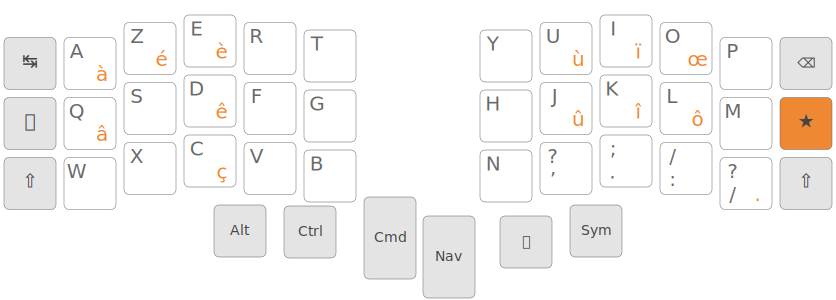

Le Quacken apporte l’essentiel des gains d’Ergo‑L aux dispositions classiques (Azerty, Qwerty, Bépo)

---
## Configuration « chouette »

Les positions médianes servent aussi au configurations 3×6

    

- on passe les colonnes d’extérieur en positions médianes
- on passe shift en maintiens d’escape / entrée
- paf, **gros** gain de confort complètement gratuit

---
## Soyez créatifs

les positions médianes permettent des configurations très spécifiques, très bizarres, mais **TRÈS** efficaces

    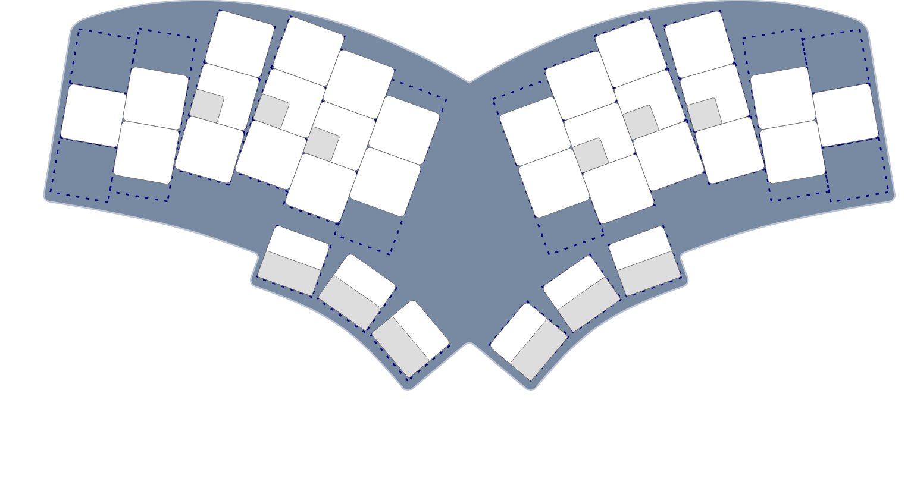

    
 Config « Hirondelle » 

---
layout: false
class: middle, inverse

# Les Ergonautes

---
## Zéro et Flex

Une géométrie (Quacken 1.0), deux modèles (Zéro et Flex)

|                               | Flex | Zéro |
|-------------------------------|:----:|:----:|
| Splittable                    | ✅   | ❌   |
| Colonnes extérieures sécables | ✅   | ✅   |
| Positions médianes            | ✅   | ✅   |
| Rotary Encoders               | ➕   | ➕   |
| Dispositifs de pointage       | 💡   | 💡   |
| Bluetooth                     | ❌   | ✅   |

<small> ✅ : compatible </small>

<small> ❌ : incompatible </small>

<small> 💡 : option en développement </small>

<small> ➕ : compatible en option </small>

---
## Batch proto du Zéro

    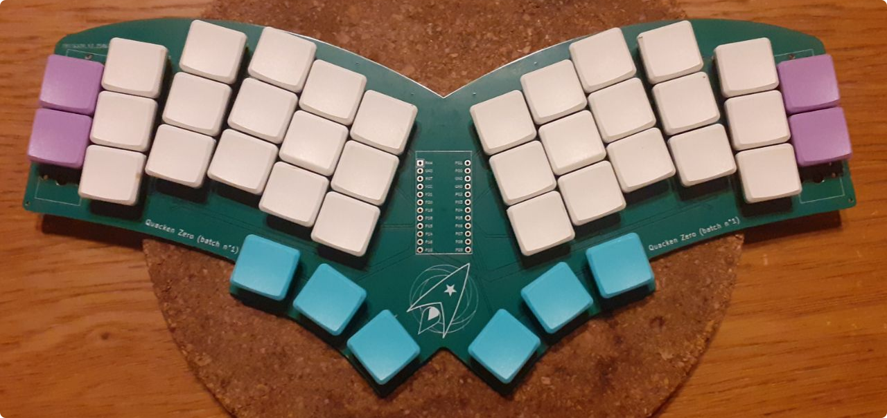

- conception Pro Micro (= top pour le BLE)
- validation de la géométrie en monobloc 42 touches
- batterie 110mAh ⇒ 2 à 3 mois d’autonomie escomptée
- batch de 20 unités (R&D + early adopters)
- firmwares ZMK et Keyberon

---
## Batch proto du Flex

- MCU intégré (RP2040) pour limiter les coûts et faciliter la fabrication
- peaufinage de la géométrie
- aucun composant sous le PCB ⇒ facile à souder et transporter
- convertible : MCU + IO expander + liaison PC
- batch de 5 unités (R&D uniquement)
- firmware ZMK fait, Keyberon à venir

---
layout: false
class: middle, inverse

# Fabrication

---
## X-mas batch

    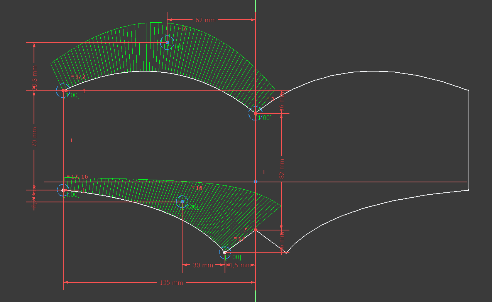

- géométrie finalisée du Quacken
- on prend les commandes dès maintenant
- le nombre permet de tirer les prix vers le bas
- les options de boitiers arriveront plus tard

---
## Prix libre

- objectif : un clavier quali pour moins de 100 €
- les sous font tourner l’asso (serveur web, batchs R&D)
- nos compte sont publics
- on accepte les dons

| item                 | coût pour l’asso    |    prix suggéré | prix Ali | prix EU
|-----------------     | -------------------:|    ------------:| --------:| -------:
| PCB (+TRRS +patins)  |           17 à 20 € |       25 à 30 € |   ~ 50 € | ~ 125 €
| switch Red Pro       |            ~ 0.60 € | 
| keycap DDC           |            ~ 0.45 € | 
| Clavier complet (×)  | soudure + 60 à 70 € |          ~ 90 € |        ? |  ~ 170 €
| Colissimo (+carton)  |            ~ 6.00 € |

---
## Rolling releases

- chaque batch est l’occasion de tester *une* nouveauté (baby steps)
- la géométrie ne bouge plus (Quacken 1.0)… ou marginalement

---
## Roadmap

- construction « Bling » : hotswap + RGB underglow
- boitiers : pour le look, tenting et rigidité au transport
- dispositifs de pointages : trackpoints et / ou touchpad
- bluetooth :
    - via une carte de dev (Pro Micro / Raspberry Pi Pico) dans un premier temps
    - intégré au PCB après

---
## Merci

    

        
 Marques recommandées 

        <ul>
            <li> KeyboardIO </li>
            <li> BastardKB </li>
        </ul>
        
 Marques déconseillées 

        <ul>
            <li> ZSA </li>
            <li> Dygma </li>
        </ul>
        
 Nous suivre 

        <ul>
            <li> Masto : #Quacken #XMasBatch </li>
            <li> HelloAsso : les Ergonautes </li>
            <li> <a href="https://ergol.org">ergol.org</a>, <a href="https://ergonautes.org">ergonautes.org</a> </li>
        </ul>
    

    

        
 Revendeurs recommandés 

        <ul>
            <li> SplitKB </li>
            <li> Keeb Supply </li>
        </ul>
        
 Claviers recommandés 

        <ul>
            <li> Corne </li>
            <li> Ferris </li>
            <li> Totem </li>
        </ul>
    

