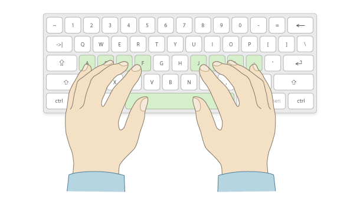

+++
layout = "slides"
+++

name: inverse
layout: true
class: center, middle, inverse

---
layout: false

# Ergol : une disposition de clavier ergonomique et moderne

---
## Qui suis-je?

- léo Cazenave
- (imbécile à haute vélocité)
- étudiant en informatique à Grenoble
- je traîne sur r/keyboard_layouts comme d’autres traînent sur pornhub

---
## Enfance martyre

- éduqué par Kazé
- contraint à taper avec Qwerty-Lafayette
- premier clavier : TypeMatrix
- premier éditeur : Vim (aujourd’hui Neovim)
- OS : ubuntu studio
- bureau : i3

---
## Posture générale — desktop

- dos droit, haut de l’écran à hauteur des yeux
- bras, bassin et genoux à &gt; 90°
- pauses régulières (changement de position)

---
## Position dactylo

- doigts sur les positions de repos
  - chaque touche du clavier est associée à un doigt précis
- les poignets restent dans l’axe
  - si la position est inconfortable, abaisser ou éloigner le clavier

---
## Regarder l’écran, pas le clavier

- dactylographie = apprentissage indispensable (~20h)
  - de nombreux sites webs existent (e.g. keybr, monkeytype…)
- apprendre par mots plutôt que par lettres
  - pro-tip : <key>ctrl</key> <key>backspace</key>
  - objectif = précision (et non vitesse)

<!-- (⇒ démo !) -->

---
## Positionnement du clavier

- clavier centré (« Ten Key Less » si possible)  
  
- poignets bien dans l’axe  
  

---
## Objectif d’ErgoL

- un layout qui optimise les 3×10 touches pour :
	+ français
	+ anglais
	+ programation
- conserve les raccouris claviers usuels (`ctrl+[QASZXCV]`)
- confort >> Vitesse
- permet une typographie nickel

---
template: inverse

# Les layouts ergonomiques populaires

---
## Dvorak (1936)

- premier essai d’optimisation du clavier
- voyelles à gauche
	+ => favorise l’alternance des mains
- perte des raccourcis claviers usuels

---
## Colemak (2006)

- enchaînements plus confortables (rolls vers le centre)
- allègement des auriculaires
- privilégie les index
- raccourcis usuels conservés (sauf `ctrl+S`)

---
## Workman (2010)

- favorise les alternances de mains *et* les rolls
- charge des doigts / heatmap très bonne
- raccourcis usuels conservés (sauf `ctrl+[CV]`)

---
## Bépo (2005)

- similaire à Dvorak (mais pour le français)
- charge des doigts **très** déséquilibrée
- lettres accentuées et ponctuation au milieu du clavier
	+ (implique `MZWÇ` en dehors des 3×10 touches)

---
## Qwerty-Lafayette (2006)

- charge des doigts assez déséquilibrée
- enchaînements relativement inconfortables
- lettres accentuées et ponctuations spéciales avec une touche morte
- symboles de prog en `AltGr`

---
## La couche `AltGr`

- pavé numérique sur la main droite
- regroupe tous les symboles de prog sur la main gauche
- optimisée pour les enchaînements courants :
	+ `[0], [-1], (), !=, (''), >=, />`
- démo !

---
## La touche morte

- permet d’écrire les accents et les ponctuations spéciales
- re démo !!

---
## ErgoL

- similaire à Workman / Colemak
- touche morte + `AltGr` du Qwerty-Lafayette
- tous les raccourcis clavier usuels conservés

---
## Pourquoi le nom ErgoL ?

- selon moi : “Ergonomic Lafayette”
- selon le bot des JDLL : carburant à fusée

---
template: inverse

# Choix d’ergonomie

---
## Colemak Lafayette

- variante de Colemak avec
	+ une touche morte Lafayette
	+ `R` et `S` échangés
- pas tant mal
- beaucoup d’enchaînements pas adaptés au français

=> Démo !

---
## C’est quoi un bon enchaînement en fait ?

- alternance de mains
- roll intérieur (ou index -> majeur)
- lettres souvent doublées sur les index c’est sympa

---
## Premier essai : les voyelles d’un côté

- intuitif, mais ajoute beaucoup de contraintes.
- => gain d’ergonomie pas incroyable

---
## Fréquence des lettres et bigrammes

- bigrammes = enchaînements de deux lettres
- données venant de corpus de textes
- permettent de savoir quels lettres / bigrammes prioriser

---
## Pourquoi pas le E sur l’index ?

- le `E` est de très loin la lettre la plus fréquente en français et anglais
- (c'est ce que Bépo a fait)

=> charge des doigts très déséquilibrée et/ou enchaînements pourris

---
## Raccourcis claviers

- `[AS]` très fréquent => home row = bien
- `[QZXCV]` pas fréquent => place secondaire = bien

Conserver les raccourcis clavier n’est donc pas un compromis sur la saisie de texte.

---
## Français **et** anglais ??

Donc oui, c'est carrément possible.

---
## Héritage de Qwerty-Lafayette

- couche `AltGr` pour les symboles de prog
- touche morte
- caractères typographiques
- => démo

---
## Style de heatmap d’ErgoL

- heatmap style « Workman » pour le français   (colonnes du centre peu chargées)
- heatmap plus « Colemak » en anglais

=> Démo

---
## ErgoL42

<!--  -->

- une seule touche morte
- touche `AltGr` optionnelle
- compatible avec les claviers ultra compacts
- moins intuitif et typographie moins facile

---
## Améliorations potentielles

- l’enchaînement `BL` est horrible, pourrait être résolu avec
	+ une interversion des lettres `Q` et `B` (simple)
	+ permutation circulaire `L`, `O`, touche morte
- les symboles de la rangée des chiffres
	+ (notamment : parenthèses sur `89` comme Qwerty EU)

---
## Faire son propre layout

- must-have : `kalamine`
- ne pas oublier les principes d’ergonomie :
	+ pas d’extensions inutiles
	+ les raccourcis claviers c’est cool
	+ faire gaffe aux enchaînements / charge des doigts / heatmap
- tester des trucs, même si ils paraissent cons

---
template: inverse

# Ayé.

[https://ergol.org](ergol.org)
