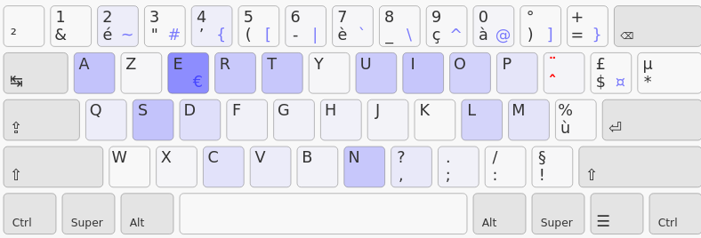
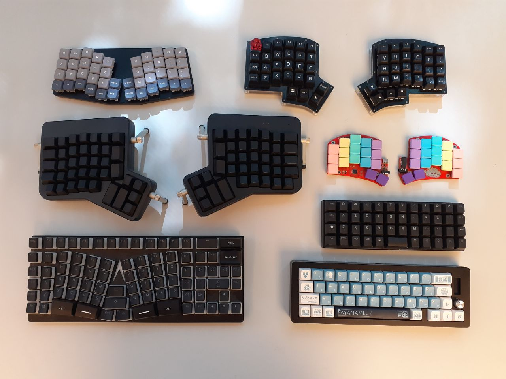
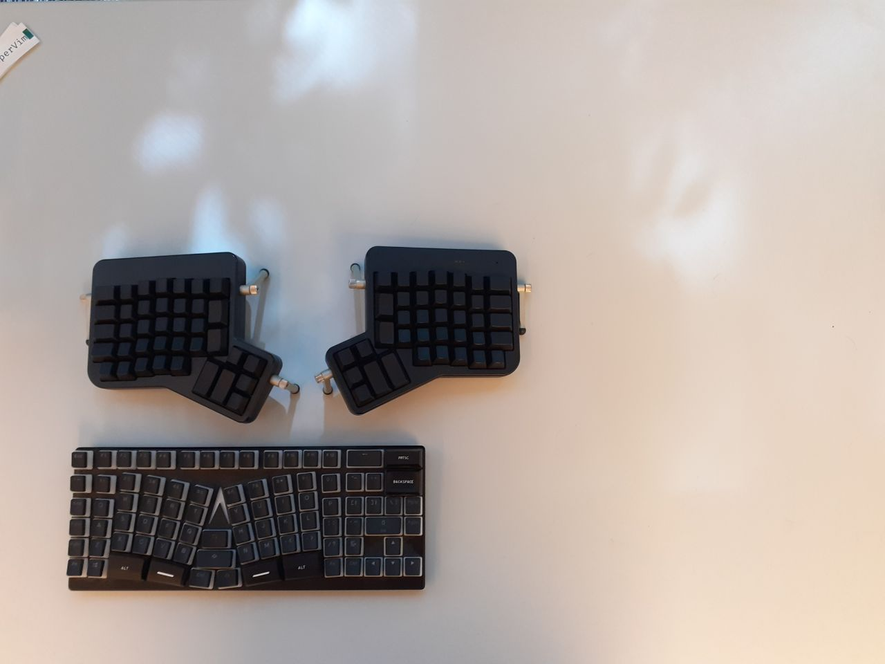
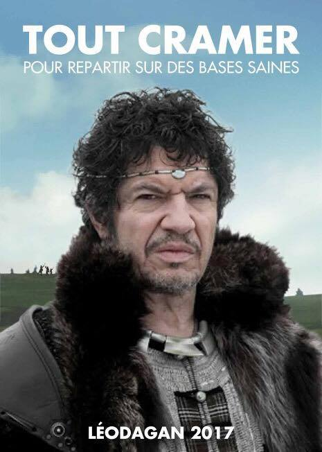
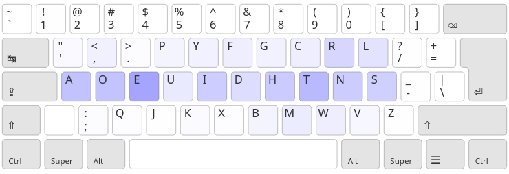
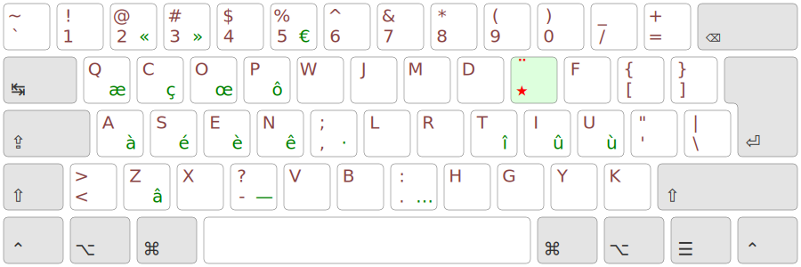
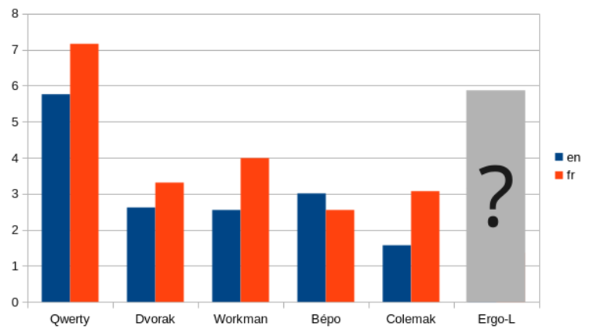
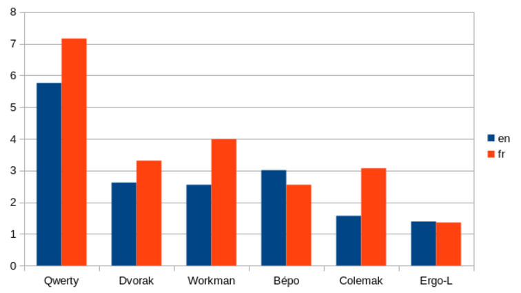
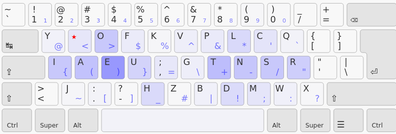

+++
layout = "slides"
+++

name: inverse
layout: true
class: center, middle, inverse

---
layout: false
class: middle, inverse

# Ergo‑L : la relève de Bépo ?

---
## Qui suis-je?

- pseudo courant : Nuclear-Squid
- vrai nom : Léo Cazenave
- étudiant en informatique et électronique à Grenoble
- dirige le projet Ergo-L

---
class: middle, inverse

# Bépo : de la genèse à l’impasse

---
## Azerty

- touches fréquentes éloignées
- charge des doigts très déséquilibrée
- trop d’enchaînements rédhibitoires (SFU ~= 7.19%)
- le `A` ? le point en `shift`-`;` ?!?!

---
## Bépo ! (2010)

- les lettres fréquentes sont sur la « home-row »
- comme Dvorak, les voyelles sont toutes à gauche
- SFU de 2.55%
- perte des raccourcis claviers usuels, chiffres en shift…

---
## Bépo ?

- rédhibitoire en anglais
- auriculaire droit trop chargé (~11.2%)
- *les quatres cavaliers de l’auriculaire* (`MZWÇ`)
    - =&gt; favorise les déviasions ulnaires, **la** source de TMS dans l’usage
      de clavier.

---
## Bépo fonctionne sur quels claviers… ?

---
## …et bah pas tant que ça en fait.

---
## Bépo : la singularité de l’ergo clavier

 

- perte des raccourcis usuels =&gt; pas adapté pour un usage clavier + souris
- les 4 cavaliers =&gt; un gros clavier (souvent cher)
- chiffres en shift =&gt; un pavé numérique

De plus, le pavé numérique décale la souris, et donc demande beaucoup plus
d’effort que la rangée des chiffres

---
## L’impasse

Beaucoup de progrès par rapport à Qwerty / Azerty, **mais** :

- l’auriculaire droit cause des douleurs chez beaucoup de gens
- beaucoup de variantes (Béopy, Bépo_developpeur, Bépo-intl…) optimisent la dispo
  sans résoudre les problèmes fondamentaux
- sacré biais de sélection : les bépoètes se sont accommodés des défauts de la dispo

---
class: middle, inverse

    

---
## Dvorak (1936)

- voyelles séparées =&gt; + de changements de mains.
- home row chargée en priorité et SFU bas (~= 2.62%)
- perte des raccourcis claviers usuels (`ctrl` + `qaszxcv`)

<small>(voir « [Ergonomie de dispositions de claviers : l’ère post Dvorak](https://www.youtube.com/watch?v=96RikfmBY-U) »)</small>

---
## Colemak (2006)

- raccourcis usuels conservés (sauf `ctrl+S`)
- favorise les alternances de mains *et* les roulements

---
## Colemak (2006)

- raccourcis usuels conservés (sauf `ctrl+S`)
- favorise les alternances de mains *et* les roulements
- SFU : ~1.57%

---
## Workman (2010)

- les colonnes du centre sont pas ouf
- les rangées du haut et bas peuvent être confortables

---
## Workman (2010)

- les colonnes du centre sont pas ouf
- les rangées du haut et bas peuvent être confortables
- <small>utiliser les touches en extensions d’auriculaires c’est tellement con
  qu’ils ne se sont même pas dit que quelqu’un le ferait un jour…</small>

---
## Workman (2010)

- \+ *excellente* charge des doigts / heatmap
- \- SFU moins bon que Colemak (~2.55%)

> =&gt; Les optimisations ne servent a rien quand il reste des problèmes d’ergonomie

---
## Comment on gère les accents ?

On les donne en accès direct :
- en extension, comme Azerty
- dans les 3×10 touches, comme Bépo

=&gt; pas compatible claviers compacts

---
## Comment on gère les accents ?

On les donne en accès direct :
- en extension, comme Azerty
- dans les 3×10 touches, comme Bépo

=&gt; pas compatible claviers compacts

 

On les met en AltGr (comme Bépo, aussi) :

=&gt; source d’erreur à haute vitesse

(voir les travaux de Ben Vallack)

---
## Touche morte !

La touche morte permet de faire les accents, diacritiques et ponctuations spéciales

- \+ compacte
- \+ inratable
- \- ajoute ~4% de touches (dont 3% pour `é` et `’`)
- \- cause quelques SFB supplémentaires

=&gt; Démo !

utilisée depuis 15 ans en Qwerty Lafayette

---
## Le `É` en deux touches, ça pique non ?

« Je continue mon entrainement dans ergo-l et je dois dire que Merde! Finalement la touche morte est pas si effrayant que ça. » – @timeprince

« La touche morte je l’adore, parce que ça veut dire qu’il y a deux fois plus de caractères en home row, et ça c’est trop bien. » – @galipeth

« La touche morte, que j’appréhendais un peu au début, s’avère très naturelle à l’utilisation. Je ressens parfois la légère pénalité en termes de frappes sur les mots avec plusieurs accents, mais je trouve le compromis (1DFH) plus que satisfaisant pour mon cas. » – @fnuttens

« C’est un choix de conception pour le moins singulier. » – @Pyjam / Floppy

---
## Qwerty-Lafayette

- stats vraiment pas ouf
- les accents et dicritiques sont sur une *touche morte*
- symboles de prog en `AltGr`

=&gt; Re démo !

---
## La fondation d’Ergo‑L

Les inspirations :

- Colemak : roulements + raccourcis clavier + SFU bas
- Workman : heatmap + minimiser les pires cas
- Qwerty‑Lafayette : touche morte + couche prog

---
## La fondation d’Ergo‑L

Les inspirations :

- Colemak : roulements + raccourcis clavier + SFU bas
- Workman : heatmap + minimiser les pires cas
- Qwerty‑Lafayette : touche morte + couche prog

Les objectifs supplémentaires :

- optimisation français + anglais + prog
- compatible avec les claviers 34 touches
- typographie nickel, sans efforts supplémentaires

---
template: inverse

# Ergo‑L : de v0.1 à v0.99

@fnuttens (Discord d’Ergo‑L)

---
## « Soyez pas con, ayez des stats » – moi

un évaluateur : la page de stats d’Ergo‑L

une méthode :

1. on teste une idée dans l’analyseur
2. on repère les défauts
3. on cherche à les corriger
4. si on y arrive on teste la dispo en vrai
5. `goto 1`

---
## Des stats, beaucoup de stats

les stats qu’on peut étudier :

- heatmap / charge des doigts
- taux de SFU / SKU
- proportion de roulements / changements de mains
- redirections, ciseaux…

---
## Des stats, beaucoup de stats

les stats qu’on peut étudier :

- heatmap / charge des doigts
- taux de SFU / SKU
- proportion de roulements / changements de mains
- redirections, ciseaux…

> =&gt; aucune n’est à prioriser, on se focalise sur les pires défauts et non
  les métriques globales

---
## Le cas du `if` et `my`

Certains enchaînements sont corrects en théorie, mais horribles en pratique. On
cherche des points communs, et en fait une nouvelle stat.

=&gt; On a découvert les ciseaux et redirections grâce à l’analyseur de `Sturdy` : https://oxey.dev/playground/

---
## Ergo‑L 1.0 !

- couche altgr repensée
- une tournante sur `fy,` pour corriger `my` et `if`
- symboles typographiques mieux placés

---
## 1DFH, un objectif qui s’est resserré

- couche alpha : 26 lettres, 4 touches de ponctuations (dont une touche morte)
- `Altgr` : 30 symboles de prog (= tout sauf virgule et point)
- les chiffres en direct !

---
## Les quatres fantastiques

Les lettres `ENTR`  :

- figurent parmi les plus fréquentes en français
- sont sous les doigts les plus forts
- s’enchaînent dans tous les sens

---
## Des compromis entre français et anglais

- `H` est fréquent en anglais, pas en français
- `★` et `U` sont fréquents en français, pas en anglais

Au final, relativement peu de compromis importants

---
## Le placement des voyelles

Les voyelles sont soit :

- empilées ensembles (comme `oe` ou `★i`)
- sur des auriculaires, pour mettre des lettres pas fréquentes autour (comme `a` et `u`)

<small>(et pas le `e` sur un index, ça cause trop de SFU)</small>

---
## Le placement des symboles de prog

- les symboles sont organisés par blocs (délimiteurs, arithétiques, ponctuation…) =&gt; simple à apprendre
- optimise les déplacements vim (`{}[]+-`)
- aucun enahaînement courant inconfortable !

---
## Ergo‑L, une dispo composable

- compatible avec **tous** les claviers de la slide 7
- les raccourcis claviers usuels conservés (+ `Ctrl`-`O`)
- compatibles applis posix (`+-` en `AltGr` + `JK`)
- chiffres en direct !!! (pas de pavé num)

---
template: inverse

# Ergo‑L v1.0…   la relève de Bépo, vraiment ?

---
## Petit jeu

---
## Petit jeu

---
## Ergo‑L vs Bépo / Dvorak

Ergo‑L n’a *que* des avantages sur Qwerty / Azerty

- Ergo‑L explose Bépo et Dvorak sur leurs *propres* métriques *et* sur d’autres métriques qu’il ne prennent en compte

---
continued: true

- dans les deux langues

---
continued: true

- … tout en gardant les raccourcis claviers

---
## v1.0 == stable

Derniers changements majeurs :

- couche prog : janvier 2024
- couche alpha : août 2023

Plus aucune aspérité significative n’est repérée depuis 6 mois.

Une merge request est ouverte pour inclure ergol dans xkb‑config.

---
## La famille Lafayette

Deux points communs :

1. le concept de touche morte à tout faire
2. la *même* couche prog

---
## La famille Lafayette

Deux points communs :

1. le concept de touche morte à tout faire
2. la *même* couche prog

Les dispo de cette famille :

- Qwerty‑Lafayette / Colemak-French-Touch : adaptations pour le français et prog
- Bépolar : Bépo avec une touche morte, une couche prog, compatible 34 touches *et* les chiffres en direct
- Erglace…

---
## Erglace (encore en développement)

Ergo‑L, mais sans les raccourcis claviers pour gagner le plus possible en SFU et redirections

SFU (fr / en) : 0.77% / 1.26%

<small>(privilégie un peu plus le français qu’Ergo‑L)</small>

---
## Ergodis

Ergodis c’est l’asso qui parraine Bépo.

À la dernière AG, ça a été décidé à unanimement qu’Ergodis fasse la pub d’Ergo‑L et Kalamine au même titre que Bépo

---
continued: true

« C’est vraiment dans la continuation de ce qu’on a voulu faire avec Bépo »

---
continued: true

Plusieurs de leurs membres tapent en Ergo‑L

---
template: inverse

# Les 5 phases du deuil du bépoète

1. <small>« C’est peut-être pas parfait, mais Bépo est vraiment efficace »</small>
2. <small>« Si on veut remplacer Azerty, il faut arrêter de parler d’Ergo‑L »</small>
3. <small>« Je me suis fait chier à apprendre Bépo et maintenant faut que je recommence ? »</small>
4. <small>« Bon, et si je “lafayettise” mon Bépo, ça joue ? »</small>
5. <small>« Ergo‑L c’est du bonheur en bol »</small>

[https://ergol.org](ergol.org)
